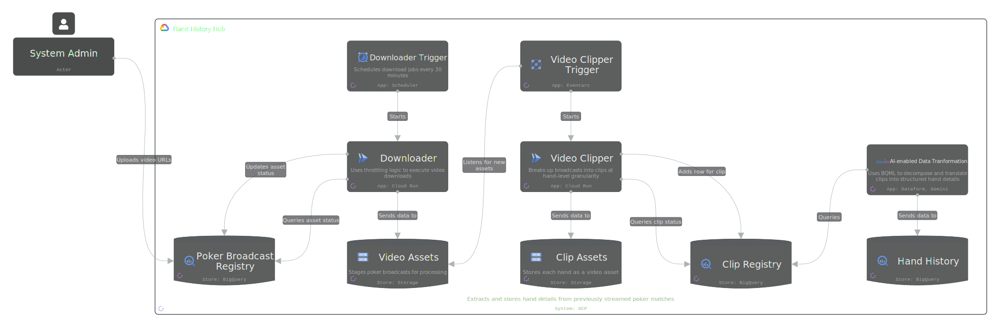
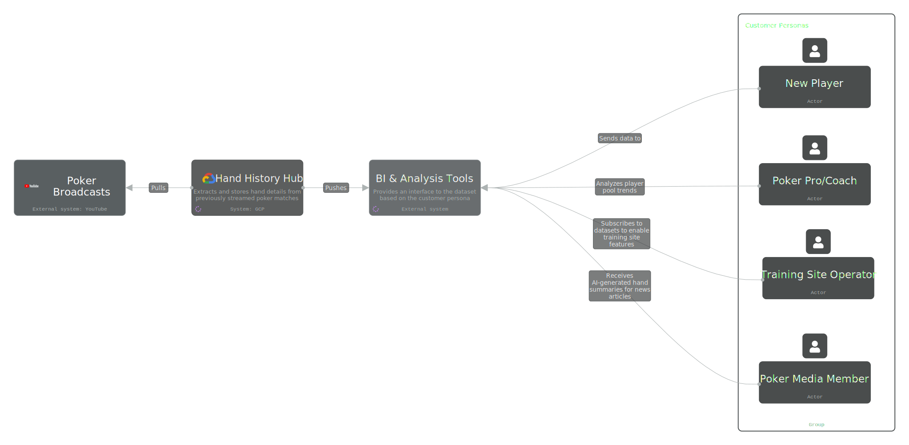

# Problem Statement

Live poker, unlike its online counterpart, lacks a commercial dataset derived from pre-recorded or live broadcasts. While online play is natively structured and machine-readable, live broadcast data remains trapped in unstructured video formats, creating a massive "dark data" gap in the industry.

The absence of these datasets has led to several systemic failures:

* Sector Stagnation: Domains such as game hosting, professional coaching, and sports journalism—which serve as primary growth channels for the game—have seen their efficiency stagnate or regress over the past two decades due to a reliance on manual data entry and anecdotal analysis.

* Failed Interdependence: There is a total lack of interoperability between media production and data-driven utility. Without a shared data layer, the industry cannot sustain logical growth pipelines—such as casinos identifying struggling players for coaching referrals, or journalists using verified win-rate improvements to craft compelling "player journey" narratives. This disconnect prevents the poker industry from leveraging the interdependent ecosystems common in other professional sports.

* Market Share Erosion: In the hyper-competitive landscape of the attention economy, poker is in a state of managed decline. It currently possesses no strategic mechanism to operationalize its most valuable content into the structured datasets required to scale its market share and engage a data-literate audience.

## Solution: The Hand History Hub

To bridge the data gap in live poker, this project introduces a cloud-native ingestion and transformation pipeline designed to convert unstructured broadcast video into standardized, actionable datasets. By leveraging serverless architecture and multimodal AI, the solution automates the end-to-end lifecycle of poker hand data.

The system operates through four core pillars:

* Automated Ingestion & Management: A centralized Poker Broadcast Registry tracks assets, while scheduled Cloud Run jobs handle the high-bandwidth task of downloading and staging multi-hour poker broadcasts.

* Granularity via Video Decomposition: The pipeline utilizes a Video Clipper trigger to segment broadcasts into hand-level granularity. These specific clips are stored as distinct assets, making the data searchable and retrievable at the most basic unit of play.

* AI-Enabled Transformation: Utilizing Gemini (Multimodal LLM), the system performs "Decompose and Translate" operations. The AI analyzes visual and auditory cues within each clip to extract structured hand details—including player actions, bet sizing, and board states.

* Structured Data Repository: Final outputs are stored in a BigQuery Hand History registry, transforming raw video into a queryable relational database that serves as the industry's shared data layer.

### System Architecture

  

[View Full Diagram](https://s.icepanel.io/dLY1ttD4YFdhq8/fsjK)

## Standardized Data Schema

To ensure maximum utility across the poker ecosystem, the Hand History Hub utilizes a variant-agnostic data model. This schema is designed to normalize the complexities of disparate poker rules into a unified relational structure.

* Variant Agnostic Design: By abstracting game logic into "Action Sequences" and "State Definitions," the model seamlessly handles any poker variant—from standard No-Limit Hold'em to complex mixed games—without requiring schema modifications. This ensures that journalists and coaches can use a single set of analytical tools to query any game type stored in the registry.

* Unified Event Stream: The schema treats every hand as a series of atomic events (e.g., Deal, Bet, Fold, Showdown). This "Event Sourcing" approach allows the data to represent the complete narrative of a hand, regardless of the number of players or the specific betting structure used.

* Future-Proofed for Real-Time: While the initial scope focuses on batch processing, the data model is architected for streaming-first compatibility. By utilizing standardized timestamps and unique event IDs, the schema is prepared to transition from processing historical broadcasts to handling live, sub-second data feeds in future MVPs without necessitating a database migration.

### Data Model

## MVP 1: Initial Project Scope

The primary objective for the first phase of this project is the deployment of a high-throughput Batch Processing Pipeline. This MVP focuses on the historical transformation of pre-recorded broadcast assets to establish a foundational dataset.

* Batch Ingestion: Developing the scheduled logic to ingest and process existing libraries of pre-recorded poker broadcasts.

* Core Transformation: Implementing the "Decompose and Translate" multimodal AI logic to convert video segments into structured hand histories.

* BigQuery Foundation: Populating the Hand History registry to enable mass data analysis capabilities, providing the first structured look at professional live poker trends.

* Analytical Readiness: Ensuring the data schema is optimized for initial BI tool integration, allowing the first wave of "Poker Pro" and "Media" personas to run complex queries against the dataset.

[View Full Diagram](./docs/poker-erd.drawio.svg)

## Ecosystem Enablement & Interdependence

The Hand History Hub acts as the primary data provider for a suite of BI & Analysis Tools, enabling a first-of-its-kind interdependent referral and reporting pipeline:

* Training & Performance: Coaches and professional players analyze "player pool" trends to identify strategic leaks. This creates a direct referral pipeline where game hosts can guide struggling players toward verified coaching resources.

* Content & Journalism: Media members receive AI-generated hand summaries, allowing for rapid, data-backed reporting on player journeys and significant win-rate milestones that were previously untrackable.

* Platform Integration: Training site operators subscribe to these datasets to power automated site features, turning raw broadcast history into interactive learning modules for new players.

### Business Context Diagram

  

[View Full Diagram](https://s.icepanel.io/dLY1ttD4YFdhq8/JUWB)

## Tech Stack
The following technologies are utilized in the Hand History Hub:

### Systems/Platforms
*   **GCP:** Google Cloud Platform, the primary cloud provider for the system.

### Applications/Services
*   **Cloud Run:** Serverless platform for running containerized applications, used by the Downloader and Video Clipper.
*   **Dataform:** Service for data transformation within the AI-enabled Data Transformation component.
*   **Gemini (AI) & BQML:** Utilized in the AI-enabled Data Transformation for decomposing and translating clips.
*   **Eventarc:** Event management service, used by the Video Clipper Trigger.
*   **Scheduler:** Implied for scheduling download jobs (e.g., every 30 minutes) by the Downloader Trigger.

### Data Stores
*   **Cloud Storage:** Used for storing Video Assets and Clip Assets.
*   **BigQuery:** Our scalable and serverless data warehouse, used for Poker Broadcast Registry and Hand History.

[//]: # (TODO: Add detailed instructions on how to set up and run the project)